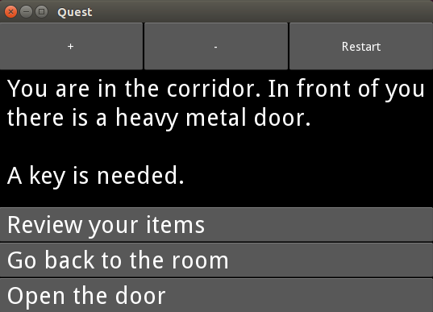

# Quest engine

It is a very small text quest engine written in python. A hundred lines for the engine and a hundred more for a graphical interface.
Works with either python 2x or python 3x.

Graphical interface uses Kivy. It can also work on Android.
If you have no Kivy it will work as a console application.

Have a look at `test.qst` for an example of quest syntax.

